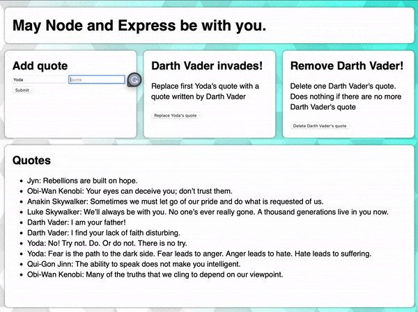

# Star Wars Quote App

Unfortunately my free hours have run out on railway, so this app is no longer hosted.
[https://star-wars-crud.up.railway.app/](https://star-wars-crud.up.railway.app/)

Users can enter a character name and quote. The quote will be added to the database and show up listed on the page. In the Darth Vader Invades section, a Yoda quote can be replaced with a Darth Vader quote. Finally, the user can also delete Darth Vader quotes. The page will automatically update the quotes section.

This project was used to practice building a CRUD app using MongoDB.

Create - Add quote  
Read - Get data from database and render to the page  
Update - Replace Yoda quote with Darth Vader quote  
Delete - Delete Darth Vader quote(s)

## Built With
- HTML
- CSS
- EJS
- JavaScript
- Node.js/Express
- MongoDB

## Optimizations
This was a basic app to practice putting together all the steps, connecting to a database, and deploying through railway. Now that I have those steps down I will use what I learned here to build bigger and more complex applications. 

## Lessons Learned
I learned how to add data from a form in the browser to a database, then access the database and render the data onto a webpage. I also learned how to structure my files to protect sensitive information in a .env file, require the information in my server.js file, and add it to the .gitignore file so it wouldn't push to github.
